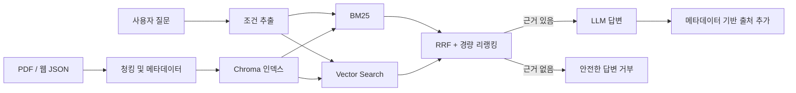

# Korea Startup Support RAG

[](https://github.com/kookie2626/korea-startup-support-rag/actions/workflows/ci.yml)
[](https://www.python.org/)
[](https://streamlit.io/)
[](LICENSE)

한국 정부·지자체의 창업지원 공고와 정책자금 문서를 검색해, 근거 문서와 함께 답변하는 Hybrid RAG 프로젝트입니다. PDF와 웹 수집 데이터를 함께 인덱싱하며 CLI와 Streamlit UI를 제공합니다.

> 이 프로젝트의 답변은 참고용입니다. 실제 신청 자격과 일정은 반드시 답변에 표시된 원문 공고에서 다시 확인하세요.

## 핵심 기능

| 기능 | 구현 |
|---|---|
| 하이브리드 검색 | 한국어 보조 토큰을 사용한 BM25와 Chroma 벡터 검색을 RRF로 결합 |
| 자격 조건 필터 | 지역·창업 단계·나이와 UI 구조화 필터 적용 |
| 안전한 실패 | 조건에 맞는 문서나 리랭커 통과 문서가 없으면 답변 생성 중단 |
| 출처 생성 | LLM 출력이 아닌 문서 메타데이터에서 파일·페이지·URL 목록 생성 |
| 반복 가능한 인덱싱 | 전체 재구축 및 문서 해시 ID로 중복 청크 방지 |
| 인터페이스 | CLI와 Streamlit UI, 질의 로그 CSV 다운로드 |
| 품질 확인 | 평가 명령, 단위 테스트, GitHub Actions CI |

## 아키텍처



검색 조건은 **fail-closed** 방식입니다. 사용자가 지정한 지역·기관·지원분야와 일치하는 문서가 없으면 조건을 무시하지 않고 빈 결과를 반환합니다.

## 프로젝트 구조

```text
korea-startup-support-rag/
├── app.py
├── streamlit_app.py
├── requirements.txt
├── requirements-dev.txt
├── src/
│   ├── config.py
│   ├── data/
│   │   ├── pdf_preprocessor.py
│   │   └── web_collectors.py
│   ├── ingest/build_index.py
│   ├── retrieval/hybrid_retriever.py
│   ├── rag/
│   │   ├── qa_chain.py
│   │   └── reranker.py
│   └── eval/run_eval.py
├── tests/
├── docs/
└── .github/workflows/ci.yml
```

## 빠른 시작

Python 3.10 이상을 권장합니다.

```bash
python -m venv .venv
source .venv/bin/activate  # Windows: .venv\Scripts\activate
pip install -r requirements.txt
cp .env.example .env
```

`.env`에 OpenAI API 키를 설정합니다.

```ini
OPENAI_API_KEY=your_key_here
OPENAI_MODEL=gpt-4.1-mini
EMBEDDING_MODEL=text-embedding-3-large
```

### 1. 데이터 준비

PDF 파일을 `data/raw/`에 넣거나 기본 웹 데이터를 수집합니다.

```bash
python app.py collect-web
```

기본 수집 대상은 다음과 같습니다.

- K-Startup 창업지원포털
- 창업진흥원(KISED)
- 중소벤처기업진흥공단(KOSME)
- 모두의창업

웹사이트 구조 변경이나 이용 정책에 따라 수집이 실패할 수 있습니다. 실제 운영 전에는 각 사이트의 이용 정책과 로봇 배제 기준을 확인하세요.

### 2. 인덱스 생성

```bash
python app.py build-index
```

`build-index`는 기존 컬렉션을 교체하는 전체 재구축 명령입니다. 동일 데이터를 반복 실행해도 문서 해시 ID를 사용하므로 중복 청크가 누적되지 않습니다.

### 3. 질문

```bash
python app.py ask "만 39세 서울 거주 예비 창업자가 받을 수 있는 지원사업은?"
```

```bash
streamlit run streamlit_app.py
```

## 답변과 출처 정책

- 검색 컨텍스트 밖의 내용은 사용하지 않도록 모델에 지시합니다.
- 지역·단계·나이 조건과 명시적 UI 필터는 일치 문서가 없을 때 자동 완화하지 않습니다.
- 리랭커 임계값을 통과한 문서가 없으면 답변 생성을 중단합니다.
- PDF 출처는 `파일명 p.페이지`, 웹 출처는 `제목 | URL`로 애플리케이션이 생성합니다.
- 이 장치들은 오류 가능성을 줄이지만 답변의 사실성을 완전히 보장하지는 않습니다.

## 평가와 테스트

데이터와 OpenAI API 키가 필요한 통합 평가는 다음 명령으로 실행합니다.

```bash
python app.py eval
```

평가 리포트에는 통과율, 인용률, 답변 거부율, 키워드 적중률과 답변 미리보기가 포함됩니다.

단위 테스트와 정적 검사는 다음과 같습니다.

```bash
pip install -r requirements-dev.txt
ruff check .
pytest -q
```

현재 내장 평가는 소규모 회귀 점검용입니다. 실제 품질 비교에는 별도의 정답 데이터셋과 Recall@K, MRR, 인용 정확도, 충실성 평가가 필요합니다.

## 개인정보와 로컬 데이터

다음 데이터는 Git에 포함되지 않습니다.

- 원본 PDF와 웹 수집 결과
- Chroma 인덱스
- 전처리 미리보기
- 사용자 질의 로그
- `.env`와 API 키

질의 로그에는 사용자가 입력한 내용이 저장될 수 있으므로 운영 환경에서는 보존 기간, 익명화, 접근 통제를 별도로 설계해야 합니다.

## 현재 한계

- 웹 수집기는 대상 사이트의 HTML 구조 변경에 영향을 받습니다.
- 나이와 지역 조건은 문서에서 추출한 메타데이터 품질에 의존합니다.
- 경량 리랭커는 전문 cross-encoder보다 정확도가 낮을 수 있습니다.
- 실제 지원 자격 판정과 신청 의사결정에는 원문 공고 확인이 필요합니다.

## License

[MIT License](LICENSE)
